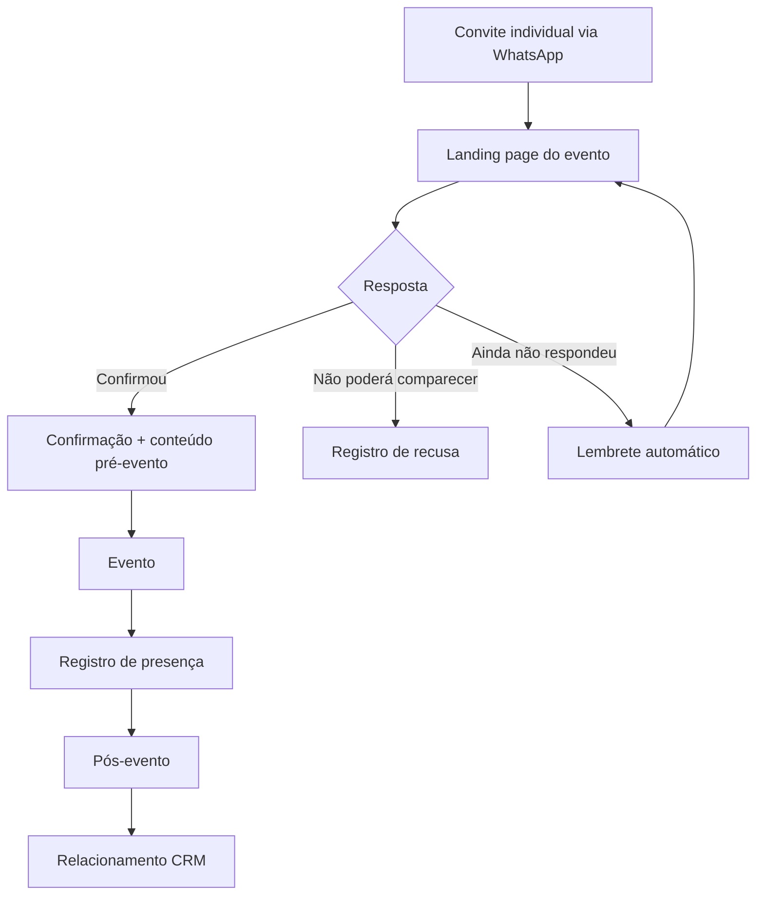

# 02 — Jornada e experiência da convidada

## 1. Visão geral

A jornada desejada é:



## 2. Etapa 1 — WhatsApp / convite

O convite é individual e deve transmitir exclusividade e cuidado.

### Objetivo

Levar a convidada para a landing page e facilitar a confirmação.

### Princípios

- mensagem curta;
- nome da nutricionista;
- motivo do convite;
- data do evento;
- CTA único e claro;
- tom elegante e pessoal;
- não transformar a primeira mensagem em apresentação comercial.

### CTA

**Ver convite e confirmar presença**

## 3. Etapa 2 — Landing page

A página deve funcionar como extensão digital do convite.

A ordem recomendada da experiência é:

1. Hero com identidade do evento.
2. Data e proposta do jantar.
3. Motivo da homenagem.
4. Destaques da experiência.
5. Informações práticas do evento.
6. Confirmação de presença.
7. Apresentação institucional da Santa Luzia.
8. Apresentação das marcas parceiras.
9. Encerramento e reforço da experiência.

A estrutura detalhada está em `03-landing-page.md`.

## 4. Etapa 3 — Confirmação

A confirmação deve exigir o mínimo de esforço.

### Estados esperados

- **Confirmada**
- **Não poderá comparecer**
- **Pendente**

O estado **Pendente** significa que houve convite, mas não houve decisão registrada.

### Regra de UX

Não tratar silêncio como recusa.

`Sem resposta ≠ Não poderá comparecer`

## 5. Etapa 4 — Pós-confirmação

Após confirmar, a experiência deve mudar para uma tela de confirmação e preparação.

Conteúdo sugerido:

> Presença confirmada! Estamos muito felizes em ter você conosco.

Em seguida:

- data do evento;
- local e horário, quando definidos;
- orientações práticas;
- pequeno texto sobre a noite;
- Santa Luzia como anfitriã;
- Nutro e Pro Diet como marcas parceiras;
- eventual apresentação de produtos/soluções estratégicos.

A apresentação comercial deve permanecer secundária à experiência do evento.

## 6. Etapa 5 — Pré-evento

A automação deve manter a convidada informada sem excesso de mensagens.

### Sequência sugerida

**Após confirmação**

Mensagem de confirmação e agradecimento.

**Alguns dias antes**

Informações práticas: horário, endereço, estacionamento, dress code e demais orientações, conforme definição do evento.

**Dia anterior**

Lembrete elegante.

**No dia**

Mensagem curta de boas-vindas:

> É hoje! Estamos esperando por você. ✨

## 7. Etapa 6 — Evento

Durante o evento, a operação deve registrar a presença real.

A presença deve ser associada ao mesmo registro da convidada no CRM.

Idealmente:

```text
Convidada
   ↓
Convite
   ↓
Confirmação
   ↓
Presença no evento
```

Não criar um novo cadastro apenas para marcar presença.

## 8. Etapa 7 — Pós-evento

A jornada continua depois do jantar.

### D+1

Agradecimento + registro de carinho pela presença.

### D+2 a D+4

Fotos, momentos do evento e conteúdo institucional/comemorativo.

### Depois

Relacionamento segmentado conforme perfil e interesse.

Exemplos:

- Home Care → soluções e relacionamento do canal Home Care;
- hospitalar → soluções para ambiente hospitalar;
- clínica/consultório → soluções aderentes ao perfil identificado.

## 9. Princípio de personalização

A experiência pode ser única no evento, mas o relacionamento posterior deve considerar o perfil da nutricionista.

A regra é:

`1 evento → vários caminhos de relacionamento`

## 10. O que não fazer

- exigir formulário extenso para confirmar presença;
- inserir venda agressiva antes da confirmação;
- tratar quem não respondeu como ausente;
- duplicar cadastro de nutricionista;
- enviar várias mensagens sem necessidade;
- misturar comunicação institucional, comercial e logística em uma única mensagem longa.
