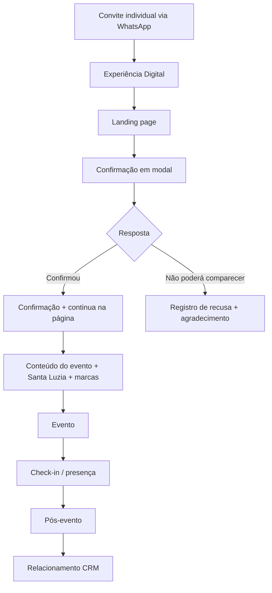

# 02 — Jornada e experiência da convidada

## 1. Visão geral

A jornada desejada é:



## 2. Etapa 1 — WhatsApp / convite

O convite é distribuído individualmente, mas o link da experiência é o mesmo para todas as convidadas.

### Objetivo

Levar a nutricionista para a experiência digital e facilitar a confirmação.

### Princípios

- mensagem curta;
- nome da nutricionista na mensagem do WhatsApp;
- motivo do convite;
- data do evento;
- CTA único e claro;
- tom elegante e pessoal;
- não transformar a primeira mensagem em apresentação comercial.

### CTA sugerido

**Conheça o convite e confirme sua presença**

## 3. Etapa 2 — Landing page

A página funciona como extensão digital do convite.

A experiência deve ser lida como uma narrativa:

1. convite e atmosfera;
2. data, horário e local;
3. motivo da celebração;
4. experiência preparada;
5. confirmação;
6. Santa Luzia como anfitriã;
7. NUTRO e PRODIET como marcas parceiras;
8. orientações práticas e localização;
9. encerramento e CTA final.

A confirmação não deve interromper essa narrativa.

## 4. Etapa 3 — Confirmação em modal

O CTA principal do Hero abre um modal/overlay na própria página.

### Dados mínimos

- nome;
- WhatsApp;
- resposta de presença.

Não será solicitado acompanhante porque o convite é individual e exclusivo.

### Estados

- **Confirmada**
- **Não poderá comparecer**
- **Pendente**

O estado **Pendente** significa que a convidada recebeu o convite, mas ainda não registrou uma decisão.

`Sem resposta ≠ Não poderá comparecer`

### Pós-confirmação

Ao confirmar, o modal muda para uma mensagem de sucesso:

> **Presença confirmada!**
>
> Estamos muito felizes em ter você conosco.

A convidada poderá fechar o modal e continuar navegando pela experiência digital.

## 5. Etapa 4 — Enriquecimento posterior

O RSVP não será usado para montar um formulário de qualificação comercial.

Depois da confirmação, informações como:

- área de atuação;
- Home Care;
- hospital;
- clínica;
- consultório;
- interesses profissionais;

podem ser enriquecidas pela equipe/CRM posteriormente.

A regra é:

**confirmação primeiro → enriquecimento depois.**

## 6. Etapa 5 — Pré-evento

Como o WhatsApp será operado manualmente, o CRM deve servir principalmente como fonte de organização para a equipe.

A equipe poderá consultar:

- quem ainda não respondeu;
- quem confirmou;
- quem recusou;
- quem precisa de lembrete;
- quem precisa receber informações logísticas.

### Sequência sugerida de comunicação manual

**Convite**

Mensagem inicial + link da experiência.

**Follow-up de pendentes**

Mensagem curta para quem ainda não confirmou.

**Após confirmação**

Agradecimento e reforço de que os detalhes serão enviados antes do evento.

**Dias antes**

Horário, endereço, estacionamento e dress code.

**Dia anterior**

Lembrete elegante.

**No dia**

Mensagem curta de boas-vindas.

## 7. Etapa 6 — Evento

A programação preliminar será organizada como uma sequência flexível:

1. recepção das nutricionistas;
2. welcome drink / acolhimento;
3. networking inicial;
4. acomodação nas mesas;
5. abertura e homenagem;
6. breve apresentação institucional da Santa Luzia;
7. apresentação breve de NUTRO e PRODIET;
8. jantar e degustação;
9. networking e relacionamento;
10. festa/confraternização.

A apresentação de marcas e produtos deve ser curta e contextual. O evento não deve assumir formato de apresentação comercial.

## 8. Ação de relacionamento durante o evento

Recomendação: cada mesa ou pequeno grupo deve ter acompanhamento informal de alguém da equipe Santa Luzia.

Objetivo:

- conhecer melhor as profissionais;
- identificar atuação e contexto profissional;
- perceber potenciais parcerias;
- fortalecer relacionamento pessoal;
- registrar posteriormente informações relevantes no CRM.

Evitar dinâmicas artificiais ou abordagem de vendas durante a celebração.

## 9. Etapa 7 — Presença

A presença física deve ser associada ao mesmo registro da nutricionista no CRM.

Fluxo:

```text
Nutricionista
   ↓
Convite
   ↓
Confirmação
   ↓
Check-in
   ↓
Presença
```

Não criar novo cadastro para registrar presença.

## 10. Etapa 8 — Pós-evento

### D+1

Agradecimento pela presença.

### D+2 a D+4

Fotos, momentos do evento e conteúdo institucional/comemorativo.

### Depois

Relacionamento segmentado conforme perfil identificado.

Exemplos:

- Home Care → relacionamento do canal Home Care;
- hospitalar → soluções e relacionamento hospitalar;
- clínica/consultório → relacionamento aderente ao perfil;
- outros → relacionamento geral.

## 11. Princípio de personalização

A experiência do evento é única, mas o relacionamento posterior pode seguir diferentes caminhos.

`1 evento → vários caminhos de relacionamento`

## 12. O que não fazer

- exigir formulário extenso para confirmar presença;
- usar token ou URL nominal sem necessidade;
- enviar a convidada para outra página apenas para confirmar;
- inserir venda agressiva antes da confirmação;
- tratar quem não respondeu como ausente;
- duplicar cadastro de nutricionista;
- automatizar mensagens de WhatsApp sem necessidade;
- misturar comunicação institucional, comercial e logística em uma única mensagem longa.
